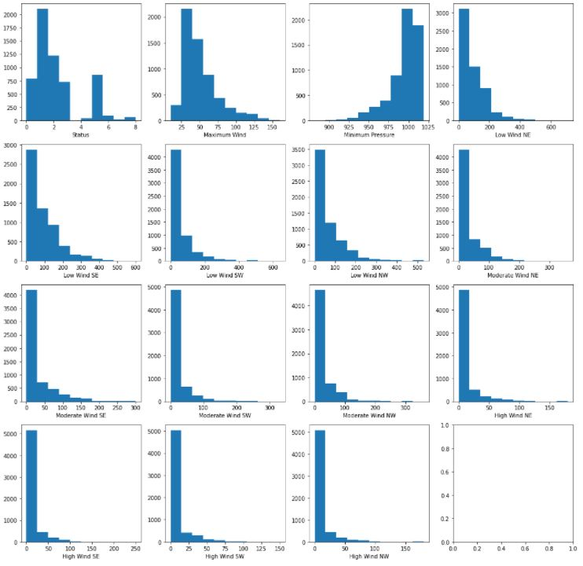
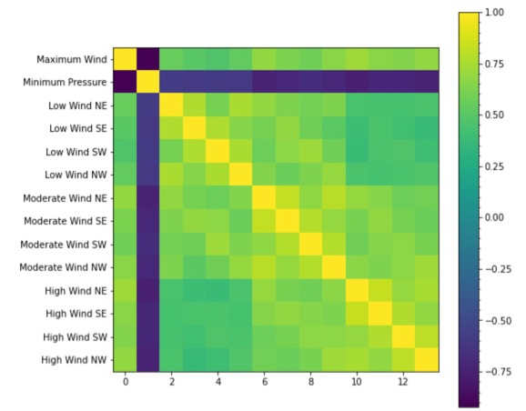
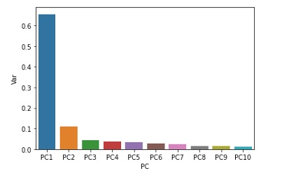
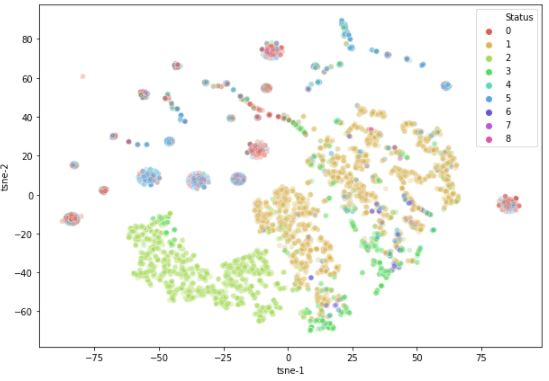

## Introduction/background
Hurricanes are thermally driven, rapidly rotating storm systems characterized by a low-pressure center whose wind speed exceeds 74 miles per hour. In 2005, Hurricane Katrina, a large Category 5 Atlantic hurricane, caused over 1,800 deaths and $125 billion in damage. The top 10 costliest hurricanes in the United States occurred in 21st century. According to real estate analytics firm CoreLogic Inc, at-risk properties have a combined value of $8.5 trillion and more than 32 million homes are at risk of hurricane damage on the Atlantic and Gulf Coasts.

### Top 5 Costliest Hurricanes in the United States
($ millions)

|Year|Hurricane|Dollars when occured|In 2020 dollars|
|----|:---------:|:--------------------:|:---------------:|
|2005| Katrina |       $65,000      |    $86,570    |
|2012| Sandy   |       $30,000      |    $33,930    |
|2017| Harvey  |       $30,000      |    $31,960    |
|2017| Irma    |       $29,900      |    $31,850    |
|2017| Maria   |       $29,670      |    $31,270    |

The proposed prediction model will identify whether a storm will hit certain locations. A timely warning or preliminary relief can be issued to at-risk communities. Additionally, this information can be used by responders to plan and prepare for upcoming disasters.

## Problem definition
The goal of this project is to accurately predict the hurricane trajectories or track forecasting which will identify the location and the intensity of the hurricane by utilizing diverse data sources to reduce economic damages and save lives. A set of predicted models can lower errors and forecast a few days ahead.

## Methods
### Data Collection and visualization
The dataset used for this project is the Atlantic Hurricane Database obtained by the National Hurricane Center (NHC) after a post-storm analysis of all available storm observations. The database includes entries dating as far back as 1851 and include numerous features including longitude, latitude, and windspeed of the storm at given times. The data was cleaned of cyclones with missing feature data (this was common for storms that occurred before modern instrumentation was introduced) then formatted in order to visualize hurricane trajectory. The ouputs that will be predicted are the latitude and the longitude for hurricane trajectories via Neural Network and the status of the hurricane which categories hurricane with classification method.

After the data has been cleaned, it was important to visualize the features and find out if there are any noises. Histograms of each feature are created and analyzed. Fortunately, there were no noises in the features, therefore, the data was ready to be impletemented. Additionally, first 5 hurricanes are plotted in Basemap to visualize the hurricane trajectories. Later on, the Basemap will be utilized to visualize predicted and actual hurricane trajectories for results.

<b>Figure 1:</b> Histogram of each feature.

<b>Figure 2:</b> Trajectories of five recent Atlantic hurricanes based on data provided by the NHC.

### Feature Analysis
Large datasets will be costly to operate and therefore needs filtering. Correlation matrix is created to analyze the relationships between features and it exhibits that all the features are either positively or negatively correlated. In order to determine the importance of each feature, Principle Component Analysis was used to determine which components are most directly correlated with the hurricane's trajectory and the status. The goal is to find the minimum number of components which captures at least 90% of the variance in the dataset. After performing PCA, it was found out that 6 principle components explain over 90% of variance. These 6 components will be used for classification and neural network.  

 <b>Figure 3:</b> Feature correlation matrix.

<b>Figure 4:</b> Variance ratio at each component.

### Classification
The status is one of the ouputs that will be predicted in this project. There are 9 different status and these are classified with different classification method. Before performing classification, the classes are visualized to see how they are clustered in a space. The t-distributed stochastic neighboring method was used with the number of components that were determined from PCA. The figure 5 shows that there are 9 different classes and it matches the first histogram in figure 1.

In order to classify accurately, different classification methods were used. Additionally, the training and testing sets were separated by 70 to 30 ratio. When performing K-Nearest Neighbor(KNN) method, different K values from 3 to 20 were considered and a best score with testing sets(0.8087) was resulted with K = 14. The Support Vector Machine(SVM) method was performed with gridsearch to find the optimal hyperparameters C and gamma and it scored 0.8149 which is slightly higher than KNN. Other classification methods such as decision tree and Guassian naive Bayes were implemented and they scored 0.7800 and 0.5791 respectively. Based on the classification, it is better to use KNN instead of the SVM even though the score is slightly lower. It is because the run time for SVM significantly longer than for KNN. Table below shows the run time and a score for each classification method.

|Classification|Score |Run time|
|--------------|:------:|:--------:|
|      KNN     |0.8087|1.51 sec|
|      SVM     |0.8149|1858 sec|
| DecisionTree |0.7800|0.03 sec|
|  Gaussian NB |0.5791|0.01 sec|

<b>Figure 5:</b> Class visualization with t-sne.

### Neural Network
Non-linear Neural Network(NN) is a dynamic model to present sequential relationship between variables. Due to the nature of forecasting hurricane trajectories, dynamical spatiotemporal processes, NN will be beneficial and effective. Hyperparameters such as number of hidden layers and learning rate will be tuned via a different method (e.g. Grid Search).

## Potential results and discussion
The model will provide the useful features from the data set and clusters of each feature which the group will analyze. More importantly, it will provide the intensity and the trajectories of hurricanes. However, there will certainly be room for an improvement. The model will not predict the precise damages a hurricane will inflict on certain communities in terms of property damage and loss of life. It will be challenging to produce those results with the same dataset. Additional data will be required to model certain outcomes.

## Reference
1. Alemany, S., Beltran, J., Perez, A., &amp; Ganzfried, S. (2019). Predicting Hurricane Trajectories Using a Recurrent Neural Network. Proceedings of the AAAI Conference on Artificial Intelligence, 33, 468–475. https://doi.org/10.1609/aaai.v33i01.3301468 
2. Facts + Statistics: Hurricanes. III. (n.d.). https://www.iii.org/fact-statistic/facts-statistics-hurricanes.
3. Frank, T. (2021, June 2). Hurricanes Threaten 32 Million U.S. Homes. Scientific American. https://www.scientificamerican.com/article/hurricanes-threaten-32-million-u-s-homes/.
4. Hartono, N. (2020, September 2). A Machine-Learning Assist to Predicting Hurricane Intensity. NASA. https://www.nasa.gov/feature/jpl/a-machine-learning-assist-to-predicting-hurricane-intensity.
