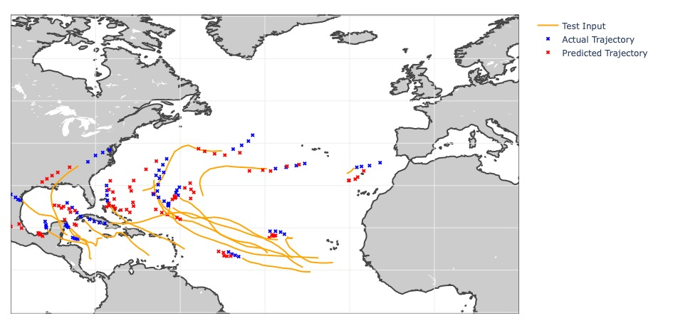
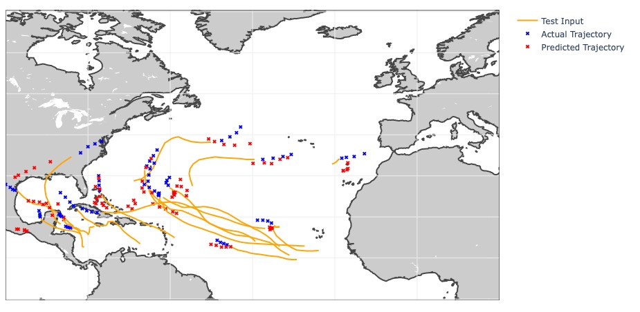

# Hurricane Prediction Model
**By: Ryan Abramowitz, H. Katrina Alcala, SooHoon Choi, Taegeun Ohe, and Connor Owen**

### Table of Contents
* [Introduction & Background](#intro)
* [Problem Definition](#problem)
* [Methods](#methods)
  - [Data Collection and Visualization](#data-collection)
  - [Feature Analysis](#feature-analysis)
  - [Storm Classification](#classification)
  - [Hurricane Trajectory Prediction](#neural-network)
* [Results and Discussion](#results)
* [References](#references)

## Introduction & Background 
Hurricanes are thermally driven, rapidly rotating storm systems characterized by a low-pressure center whose wind speed exceeds 74 miles per hour. In 2005, Hurricane Katrina, a large Category 5 Atlantic hurricane, caused over 1,800 deaths and $125 billion in damage. The top 10 costliest hurricanes in the United States occurred in 21st century. According to real estate analytics firm CoreLogic Inc, more than 32 million homes are at risk of hurricane damage on the Atlantic and Gulf Coasts, with a combined value of $8.5 trillion.  

The proposed predictive model will identify whether a hurricane will hit certain locations. A timely warning or preliminary relief can be issued to at-risk communities. Additionally, this information can be used by responders to plan and prepare for upcoming disasters.

## Problem Definition 
The goal of this project is to accurately predict the hurricane trajectories or track forecasting which will identify the location and the intensity of the hurricane by utilizing diverse data sources to reduce economic damages and save lives. Additionally, the class of each tropical cyclone will be predicted to prevent from unnecessary evacuations or unnecessary resources supply (e.g. a tropical cyclone that never develops into a hurricane). A set of predicted models can lower errors and forecast a few days ahead.

## Methods 
### Data Collection and Visualization  
The dataset used for this project is the Atlantic Hurricane Database, which includes tropical storm and hurricane observations, and is maintained by the National Hurricane Center (NHC). The database includes entries dating as far back as 1851 and include numerous features including longitude, latitude, and windspeed of the storm at given times. The data was cleaned of cyclones with missing feature data (this was common for storms that occurred before modern instrumentation was introduced) then formatted in order to visualize hurricane trajectory. The ouputs that will be predicted are the latitude and the longitude for hurricane trajectories via Neural Network and the status of the tropical cyclone (as defined in a custom scaled used by the NHC).

The data was first cleaned of missing rows and null values. Next, it was important to visualize the features and detect outliers/noise. Histograms of each feature were created and analyzed. Fortunately, there were no significant outliers in the features and the data was ready to be fed into the model. For a better visualization of the data, the first 5 hurricanes and their trajectories are plotted in Python's Basemap library; later on, Basemap will be utilized to visualize predicted and actual hurricane trajectories for results.

<b>Figure 1:</b> Trajectories of five recent Atlantic hurricanes based on data provided by the NHC.

### Feature Analysis 
Large datasets will be costly to operate and therefore needs filtering. A correlation matrix is created to analyze the relationships between the features, and it exhibits that all the features are either positively or negatively correlated. 

<b>Figure 2:</b> To the left is a histogram showing each feature in the dataset. On the right is a heatmap showing feature correlation.

In order to determine the importance of each feature, Principle Component Analysis (PCA) was used to determine which components are most directly correlated with the hurricane's trajectory and the status. The goal is to find the minimum number of components which captures at least 90% of the variance in the dataset. After performing PCA, it was found that 6 principle components explain over 90% of variance. These 6 components will be used for classification and, ultimately, the  neural network.

<b>Figure 3:</b> Variance ratio at each component.

Based on the feature analysis done above, a total of 6 principal components are necessary to maintain 90% of the dataset's variance. This is a 40% reduction from the original number of components.

### Storm Classification 

<b>Figure 4:</b>Performance results of several classification algorithms

In order to classify storms accurately, different classification algorithms were used on the dataset and compared against each other. First, the dataset was split into a training set (70% of the original set) and a test set (30% of the original set). The different methods utilized SMOTE() which is a technique to help with class balancing when classes have low sample counts by using existing samples in the dataset to create synthetic samples. By balancing the classes, we can improve the metrics (precision and recall) on the minority classes. Additionally, the group experimented with how random oversampling would effect the results. The different algorithms were then run using SMOTE imbalanced and balanced data, random oversampled data, and unbalanced data taking into account each method's overall accuracy and runtime.

When performing K-Nearest Neighbor(KNN) method, different K values from 3 to 20 were considered and a best score with testing sets (0.8087) was found with K = 14. The Support Vector Machine (SVM) method was performed with gridsearch to find the optimal hyperparameters C and gamma, and it scored 0.8149, which is slightly higher than KNN. Other classification methods such as decision tree and Guassian naive Bayes were implemented and they scored 0.7800 and 0.5791 respectively. Based on the classification, it is better to use KNN instead of the SVM even though the score is slightly lower. It is because the run time for SVM significantly longer than for KNN. 

The table in **Figure 4** shows the run time and a score for each classification method. When looking at the results of the classification algorithms using unbalanced data, all the classification algorithms resulted in a decent score (close to 80%) except for the Gaussian Naive Bayes method. Training the models on the class balanced data (whether with SMOTE or random oversampling) helps with precision and recall on the minority classes, while the overall weighted precision goes down. Depending on the use case, the user would need to know the limitations of the model. SVM with gridsearch takes a significant amount of time and should not be used for our purposes. The score is only slightly higher on average but not significantly different. The most reasonable method for classification based on the results is Random Forest.

### Hurricane Trajectory Prediction 
In order to actually predict the trajectory of any upcoming hurricane, the group decided to utilize a Non-linear Neural Network (NN), a dynamic model which presents a sequential relationship between variables. Due to the nature of forecasting hurricane trajectories, the group decided to use a dynamical spatio-temporal process to establish a neural network to create a visualization of a hurricane's trajectory from one time period to the next. Hyperparameters such as number of hidden layers and learning rate will be tuned via a different method (e.g. Grid Search). 

The data was filtered to only analyze hurricane data (filtering out tropical storms, cyclones, etc) in an effort to both reduce learning time and achieve a more accurate prediction. A sequential model was generated using long short-term memory (LSTM) and the Keras API to analyze time series data based on the dataset. Fortunately, the given dataset provided data in regular intervals with the exception of including additional data when the hurricane experienced landfall. This timeseries data was then analyzed to create predictive model which can return a predicted trajectory of a hurricane. Two models were created: the first is a simple sequential model using LSTM and the second is a 2-stacked model using LSTM which theoretically would capture more complexities. The results are shown below.

<b>Figure 5:</b>Hurricane trajectory prediction using simple LSTM model.

<b>Figure 6:</b>Hurricane trajectory prediction using stacked LSTM model.

## Results and Discussion 
This project used tropical storm data provided by the NHC in order to create a machine learning algorthm to predict hurricane trajectory. The data was cleaned and underwent a feature analysis using PCA in order to speed up the algorithm. It was found that using 6 principle components would be sufficient for retaining 90% of the variance. One of the goals of this project was to choose a classification algorithm which can be used to classify a future hurricane's status. The group compared KNN, PCA, SVM, Decision Tree, Random Forest, and Gaussian Naive Bayes with SMOTE balanced/unbalanced data and randomly oversampled balanced data and determined the Random Forest was the most reasonable method for our classification purposes. Finally, using the Keras API, a simple and model and a 2-stacked layer model were created to map hurricane trajectories as shown in **Figure 5** and **Figure 6**. The models are designed to process the previous hurricane trajectory and predict the trajectory over the next 36 hours. 

## References 
1. Alemany, S., Beltran, J., Perez, A., &amp; Ganzfried, S. (2019). Predicting Hurricane Trajectories Using a Recurrent Neural Network. Proceedings of the AAAI Conference on Artificial Intelligence, 33, 468–475. https://doi.org/10.1609/aaai.v33i01.3301468 
2. Facts + Statistics: Hurricanes. III. (n.d.). https://www.iii.org/fact-statistic/facts-statistics-hurricanes.
3. Frank, T. (2021, June 2). Hurricanes Threaten 32 Million U.S. Homes. Scientific American. https://www.scientificamerican.com/article/hurricanes-threaten-32-million-u-s-homes/.
4. Hartono, N. (2020, September 2). A Machine-Learning Assist to Predicting Hurricane Intensity. NASA. https://www.nasa.gov/feature/jpl/a-machine-learning-assist-to-predicting-hurricane-intensity.
